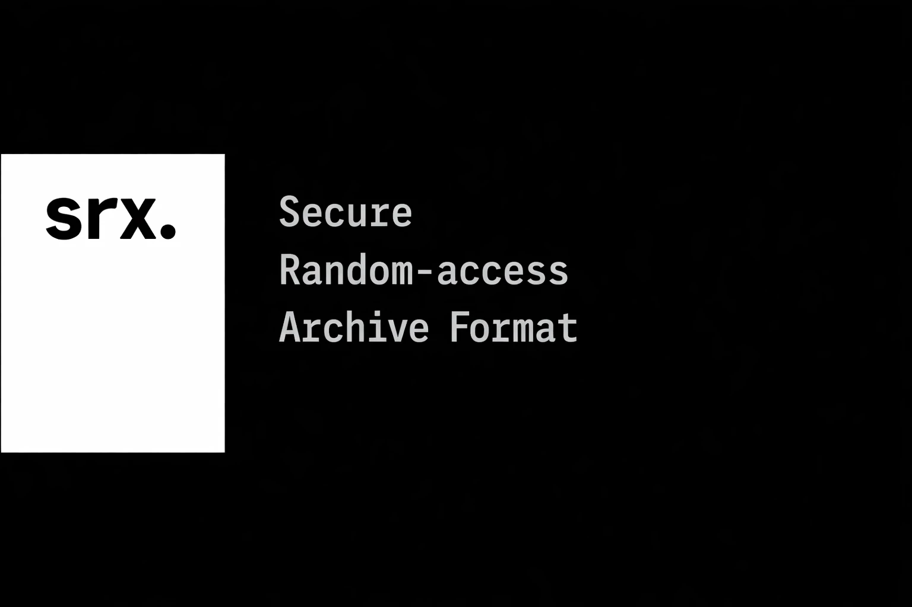
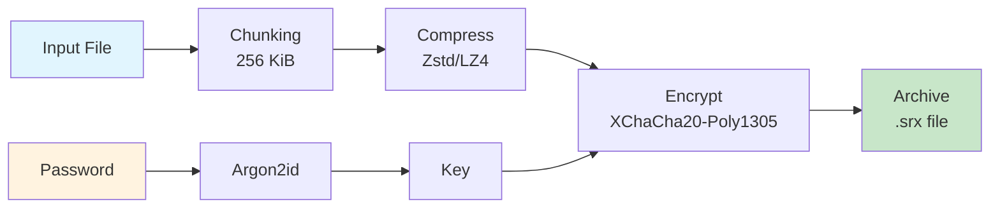

<div align="center">

# SRX

**Secure Random-access Archive Format**

A modern compressed + encrypted archive format designed for performance, security, and extensibility.

[](https://www.rust-lang.org/)
[](https://www.gnu.org/licenses/gpl-3.0)
[](https://github.com/)



</div>

---

## Features

- **Authenticated Encryption** - XChaCha20-Poly1305 AEAD cipher with per-chunk authentication
- **Password Protection** - Argon2id key derivation resistant to GPU/ASIC attacks
- **Fast Compression** - Zstd (default) or LZ4, with chunk-level parallelism
- **Integrity Verification** - BLAKE3 hash for whole-file integrity
- **Random Access** - Extract portions without decompressing the entire archive
- **Streaming Support** - Process files larger than available memory
- **Security First** - No custom cryptography, only proven primitives
- **Extensible Format** - TLV-based metadata for future compatibility

## Quick Start

### Prerequisites

- Rust 1.70 or later

### Installation

```bash
git clone https://github.com/Jamshed-develop/srx.git
cd srx
cargo build --release
```

The binary will be at `./target/release/srx`.

Install srx using Cargo:
```bash
cargo install srx-rs
```

### 30-Second Example

```bash
# Pack a file with encryption
./target/release/srx pack document.pdf archive.srx -p "secure_password"

# View archive info
./target/release/srx info archive.srx -p "secure_password"

# Unpack the file
./target/release/srx unpack archive.srx -p "secure_password"
```

---

## Why SRX?

Traditional archive formats like ZIP and 7Z were designed decades ago. SRX is built for modern threats and modern hardware.

| Feature | ZIP | 7Z | SRX |
|---------|-----|-----|-----|
| Authenticated encryption | No | Optional | **Always** |
| Random access | Yes | Limited | **Yes** |
| Parallel compression | No | Optional | **Yes** |
| Streaming decompression | No | Limited | **Yes** |
| Modern crypto (AEAD) | No | Optional | **Yes** |
| Integrity verification | CRC32 | Optional | **BLAKE3** |
| Timing-attack resistant | No | Depends | **Yes** |
| Password hashing | Weak | Optional | **Argon2id** |

### Design Philosophy

SRX prioritizes in order:

1. **Correctness & Security** - No custom crypto, only battle-tested primitives
2. **Performance on modern CPUs** - Chunk-based parallel processing
3. **Low overhead** - Efficient for small and medium files
4. **Extensibility** - Future-proof TLV metadata system

---

## Architecture



### Processing Pipeline

```
Original File: [Chunk 0][Chunk 1][Chunk 2]...
                    │        │        │
               ┌────▼───┐ ┌──▼───┐ ┌──▼───┐
               │Compress│ │Compress│ │Compress│
               └────┬───┘ └──┬───┘ └──┬───┘
                    │        │        │
               ┌────▼───┐ ┌──▼───┐ ┌──▼───┐
               │Encrypt │ │Encrypt│ │Encrypt│
               └────┬───┘ └──┬───┘ └──┬───┘
                    │        │        │
Archive:       [EChunk0][EChunk1][EChunk2]...[Index][Footer]
```

### Chunk-Based Design Benefits

- **Random Access** - Extract any chunk independently
- **Parallel Processing** - All chunks processed simultaneously
- **Streaming** - Work with files larger than RAM
- **Early Detection** - Per-chunk authentication catches corruption immediately

---

## Cryptographic Choices

### Encryption: XChaCha20-Poly1305

| Aspect | SRX Choice | Why |
|--------|------------|-----|
| Cipher | XChaCha20 | Constant-time, immune to timing attacks, faster in software than AES |
| Nonce size | 24 bytes | Allows random generation without collision risk for huge archives |
| Authentication | Poly1305 | Every chunk authenticated, tampering always detected |

### Key Derivation: Argon2id

| Parameter | Value | Rationale |
|-----------|-------|-----------|
| Memory | 64 MiB | Resists GPU/ASIC attacks |
| Iterations | 3 | Balance between security and usability |
| Parallelism | 4 threads | Utilizes modern multi-core CPUs |
| Output | 32 bytes | 256-bit key for XChaCha20 |

### Integrity: BLAKE3

- **Speed**: ~1 GB/s on modern CPUs
- **Security**: Based on BLAKE2, extensively analyzed in SHA-3 competition
- **Parallelism**: Takes full advantage of SIMD instructions

---

## Usage Reference

### Command Line Interface

#### Pack a File

```bash
srx pack <INPUT> <OUTPUT> -p <PASSWORD> [OPTIONS]
```

| Option | Description | Default |
|--------|-------------|---------|
| `-p, --password` | Encryption password | Required |
| `-a, --algo` | Compression algorithm | `zstd` |
| `-l, --level` | Compression level (0-22) | `3` |

**Compression Algorithms:**

| Algorithm | Speed | Ratio | Best For |
|-----------|-------|-------|----------|
| `zstd` | Fast | Good | General use (default) |
| `lz4` | Very Fast | Moderate | Speed-critical applications |
| `none` | Instant | 1:1 | Pre-compressed data (images, videos) |

**Examples:**

```bash
# Default compression (zstd level 3)
srx pack video.mp4 video.srx -p "my_password"

# Maximum compression (slower, smaller)
srx pack data.tar data.srx -p "secure" -l 19

# Fast compression (larger, faster)
srx pack logs.txt logs.srx -p "key" -a lz4

# No compression (for already compressed data)
srx pack photo.jpg photo.srx -p "secret" -a none
```

#### Unpack a File

```bash
srx unpack <INPUT> -p <PASSWORD>
```

The original filename is preserved from the archive.

**Examples:**

```bash
srx unpack archive.srx -p "my_password"
```

#### View Archive Info

```bash
srx info <INPUT> -p <PASSWORD>
```

**Output:**

```
Filename: document.pdf
Original size: 1048576 bytes
Compressed size: 524288 bytes
Ratio: 50.0%
Chunks: 4
Compression: Zstd
Encrypted: true
```

---

## Using as a Library

Add SRX to your `Cargo.toml`:

```toml
[dependencies]
srx = { git = "https://github.com/Jamshed-develop/srx.git" }
```

### Pack a File

```rust
use srx::{Packer, compression::CompressionAlgo};

fn main() -> Result<(), Box<dyn std::error::Error>> {
    let packer = Packer::new("secure_password".to_string())
        .compression_algo(CompressionAlgo::Zstd)
        .compression_level(3)
        .chunk_size(512 * 1024); // 512 KiB chunks
    
    packer.pack("input.txt", "output.srx")?;
    
    println!("Archive created successfully!");
    Ok(())
}
```

### Unpack a File

```rust
use srx::Unpacker;

fn main() -> Result<(), Box<dyn std::error::Error>> {
    let unpacker = Unpacker::new("secure_password".to_string());
    unpacker.unpack("archive.srx")?;
    
    println!("File extracted successfully!");
    Ok(())
}
```

### Get Archive Information

```rust
use srx::Unpacker;

fn main() -> Result<(), Box<dyn std::error::Error>> {
    let unpacker = Unpacker::new("secure_password".to_string());
    let info = unpacker.info("archive.srx")?;
    
    println!("Filename: {}", info.filename);
    println!("Original size: {} bytes", info.original_size);
    println!("Compressed size: {} bytes", info.compressed_size);
    println!("Ratio: {:.1}%", info.compressed_size as f64 / info.original_size as f64 * 100.0);
    println!("Chunks: {}", info.chunk_count);
    println!("Compression: {:?}", info.compression_algo);
    println!("Encrypted: {}", info.encrypted);
    
    Ok(())
}
```

### Custom Configuration

```rust
use srx::{Packer, compression::CompressionAlgo};

// Fast compression for speed-critical applications
let fast_packer = Packer::new("password".to_string())
    .compression_algo(CompressionAlgo::Lz4);

// Maximum compression for archival
let high_compression = Packer::new("password".to_string())
    .compression_algo(CompressionAlgo::Zstd)
    .compression_level(19);

// Larger chunks for better compression ratio
let large_chunks = Packer::new("password".to_string())
    .chunk_size(1024 * 1024); // 1 MiB

// Smaller chunks for more parallelism
let small_chunks = Packer::new("password".to_string())
    .chunk_size(64 * 1024); // 64 KiB
```

---

## File Format

See [SPEC.md](SPEC.md) for the complete specification.

```
┌─────────────────────────┐
│      Fixed Header       │  32 bytes
│    Magic: "SRX1"        │
│    Version, Flags       │
│    Metadata Length      │
│    Chunk Count          │
├─────────────────────────┤
│   TLV Metadata Section  │  Variable
│    Compression Algo     │
│    Encryption Algo      │
│    Original Filename    │
│    Argon2 Parameters    │
│    Salt                 │
├─────────────────────────┤
│    Chunk Index Table    │  Variable
│    Offset, Sizes        │
│    Nonces, Auth Tags    │
├─────────────────────────┤
│   Encrypted Data Chunks │  Variable
│    Chunk 0..N           │
├─────────────────────────┤
│    Integrity Footer     │  32 bytes
│    BLAKE3 Hash          │
└─────────────────────────┘
```

### Key Properties

- **Magic Bytes**: `SRX1` (4 bytes) - identifies the format and version
- **Chunk Index**: Enables O(1) random access to any chunk
- **TLV Metadata**: Extensible without breaking backward compatibility
- **Per-Chunk Auth**: Each chunk authenticated separately with Poly1305

---

## Performance

### Compression Performance

| Algorithm | Compression | Decompression | Ratio (typical) |
|-----------|-------------|---------------|-----------------|
| Zstd -3 | ~400 MB/s | ~1000 MB/s | ~40% |
| Zstd -19 | ~50 MB/s | ~1000 MB/s | ~30% |
| LZ4 | ~500 MB/s | ~2000 MB/s | ~50% |

### Encryption Overhead

| Component | Overhead |
|-----------|----------|
| Per chunk | 16 bytes (auth tag) + 24 bytes (nonce stored in index) |
| Key derivation | ~100ms one-time cost (Argon2id) |

### Typical Archive Sizes

| Original | SRX (Zstd-3) | SRX (LZ4) | SRX (None) |
|----------|--------------|-----------|------------|
| 1 MB text | ~250 KB | ~400 KB | ~1 MB + 40 bytes/chunk |
| 10 MB code | ~2 MB | ~4 MB | ~10 MB |
| 100 MB JSON | ~5 MB | ~20 MB | ~100 MB |

---

## Security Model

### What SRX Protects Against

| Threat | Protection |
|--------|------------|
| Passive eavesdropping | Encrypted data unreadable without password |
| Data tampering | Poly1305 authentication detects modification |
| Chunk manipulation | Per-chunk tags prevent reordering/replacement |
| Password cracking | Argon2id resists brute-force attacks |
| Chosen-ciphertext attacks | AEAD construction is provably secure |

### What SRX Does NOT Protect Against

| Threat | Reason |
|--------|--------|
| Password compromise | Strong passwords are user's responsibility |
| Side-channel attacks on host | Assumes trusted execution environment |
| Metadata leakage | Archive size approximates original file size |
| Ransomware | SRX does not prevent file deletion |

### Security Recommendations

1. **Use strong passwords** - Passphrases preferred (4+ random words)
2. **Unique passwords** - Different password for each archive
3. **Secure deletion** - Use `shred` or similar after packing
4. **Password manager** - Store passwords in a secure vault
5. **Offsite backups** - Keep encrypted archives in multiple locations

---

## Development

### Building from Source

```bash
# Debug build (fast compile, slow runtime)
cargo build

# Release build (slow compile, fast runtime)
cargo build --release

# With optimizations
cargo build --release --config profile.release.lto=true
```

### Running Tests

```bash
# Run all tests
cargo test

# Run specific test
cargo test pack_unpack_roundtrip

# Run with verbose output
cargo test -- --nocapture
```

### Running Benchmarks

```bash
# Run all benchmarks
cargo bench

# Run specific benchmark
cargo bench -- compression
```

### Code Structure

```
src/
├── lib.rs           # Public API exports
├── main.rs          # CLI entry point
├── archive.rs       # Pack/unpack operations
├── format/
│   ├── mod.rs       # Format module exports
│   ├── header.rs    # Binary header parsing
│   ├── tlv.rs       # TLV metadata handling
│   └── chunk_index.rs # Chunk index table
├── crypto/
│   └── mod.rs       # XChaCha20-Poly1305, Argon2id
└── compression/
    └── mod.rs       # Zstd, LZ4 wrappers
```

---

## Roadmap

### v1.1 (Next Release)

- [ ] Multi-file archive support
- [ ] Password change without re-encryption
- [ ] Progress callbacks for library users
- [ ] Pre-built binaries for Windows/macOS/Linux
- [ ] Archive verification mode (`srx verify`)

### v1.2

- [ ] Random access read/write (modify without full extract)
- [ ] Streaming mode for arbitrarily large files
- [ ] Parallel encryption/decryption (rayon)
- [ ] File comments and timestamps
- [ ] Compression deduplication

### v2.0 (Future)

- [ ] GUI application
- [ ] Cloud storage integration (S3, GCS, Azure)
- [ ] Differential backups
- [ ] Cross-platform file browser integration
- [ ] Hardware acceleration (AES-NI, AVX-512)

---

## Acknowledgments

SRX is built on the shoulders of giants. Special thanks to:

### Cryptography

- **[XChaCha20-Poly1305](https://crates.io/crates/chacha20poly1305)** - Authenticated encryption
- **[Argon2](https://crates.io/crates/argon2)** - Password hashing
- **[BLAKE3](https://crates.io/crates/blake3)** - Fast cryptographic hash

### Compression

- **[zstd](https://crates.io/crates/zstd)** - Zstandard bindings
- **[lz4_flex](https://crates.io/crates/lz4_flex)** - Pure Rust LZ4

### Infrastructure

- **[clap](https://crates.io/crates/clap)** - CLI argument parsing
- **[thiserror](https://crates.io/crates/thiserror)** - Error handling
- **[rand](https://crates.io/crates/rand)** - Random number generation

### Inspiration

- [age](https://github.com/FiloSottile/age) - Modern encryption tool
- [rage](https://github.com/str4d/rage) - Rust implementation of age
- [minisign](https://jedisct1.github.io/minisign/) - Simplified signing

---

## Contributing

Contributions are welcome! Please read our contributing guidelines before submitting PRs.

1. Fork the repository
2. Create your feature branch (`git checkout -b feature/amazing-feature`)
3. Commit your changes (`git commit -m 'Add amazing feature'`)
4. Push to the branch (`git push origin feature/amazing-feature`)
5. Open a Pull Request

### Code of Conduct

- Be respectful and inclusive
- Focus on constructive feedback
- Help others learn and grow

---

## License

This project is licensed under the GNU General Public License v3.0 - see the [LICENSE](LICENSE) file for details.

```
GNU GENERAL PUBLIC LICENSE
Version 3, 29 June 2007

Copyright (C) 2024 SRX Contributors

This program is free software: you can redistribute it and/or modify
it under the terms of the GNU General Public License as published by
the Free Software Foundation, either version 3 of the License, or
(at your option) any later version.

This program is distributed in the hope that it will be useful,
but WITHOUT ANY WARRANTY; without even the implied warranty of
MERCHANTABILITY or FITNESS FOR A PARTICULAR PURPOSE.  See the
GNU General Public License for more details.

You should have received a copy of the GNU General Public License
along with this program.  If not, see <https://www.gnu.org/licenses/>.
```

**Key Points:**
- ✅ Free to use, modify, and distribute
- ✅ Must preserve copyleft - derivative works must also be GPL v3
- ✅ Must provide source code when distributing
- ✅ Must include license and copyright notice

---

<div align="center">

**[Report Bug](https://github.com/Jamshed-develop/srx/issues) · [Request Feature](https://github.com/Jamshed-develop/srx/issues) · [Read Spec](SPEC.md)**

Made with ❤️ in Rust

</div>
